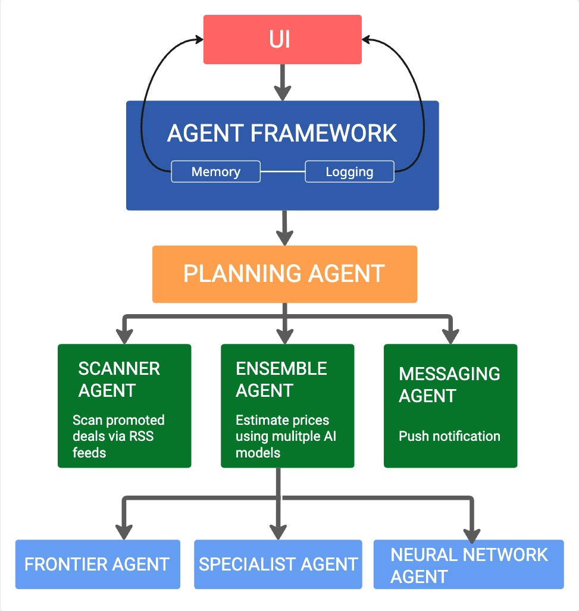

# WorthBrain

Autonomous Multi-Agent Deal Intelligence System (Deal Hunter)

## Overview

WorthBrain is a multi-agent system designed to automatically discover, evaluate, and surface high value online deals (with a lot of discount). 
It integrates multiple AI components, including a fine-tuned open-source LLM (QLoRA), a frontier model API, and a custom neural network estimator. 
The system runs autonomously and streams live updates to a Gradio-based UI and mobile devices of the users by push notification.

The core objective of WorthBrain is to:

1. Discover new deals online

2. Estimate fair value using multiple AI models and price data

3. Calculate discount potential

4. Select the strongest opportunity (Most valuable deal, price-wise)

5. Notify the user via an LLM-generated message and the deal table in the UI

## System Architecture

At the highest level, WorthBrain is structured into two major layers:

- Agent Orchestration Layer

- User Interface Layer

The orchestration layer contains the Agent Framework and its sub-agents. The UI layer is responsible for rendering logs and results in real time.

### Agent Structure

1. Agent Framework 
    - Memory 
    - Logging 
    - Planning Agent

2. Planning Agent coordinates:
   - Scanner Agent (RSS deal discovery)
   - Ensemble Agent (multi model price estimation, using 3 models)
   - Messaging Agent (LLM-generated notification)

3. The Ensemble Agent internally combines:
    - Specialist Agent (LLaMA 3.1 8B model Fine-tuned with QLoRA)
    - Frontier Agent (GPT 5 mini with RAG -- Amazon dataset)
    - Neural Network Agent (Custom neural network built with Scikit Learn)

Each sub-agent has a clearly defined responsibility and communicates through structured objects (Deal, Opportunity, etc.)

### Runtime Data Flow

WorthBrain uses a producer–consumer concurrency model with queues to separate computation from UI updates.

The execution flow is as follows:

1. Gradio UI triggers run_with_logging() on load.

2. run_with_logging():
    - Creates log_queue and result_queue 
    - Registers a QueueHandler for logging 
    - Starts a background worker thread

3. Background Worker (Producer):
    - Executes AgentFramework.run()
    - During execution, logging.info(...) sends formatted log records into log_queue 
    - After completion, places the final opportunity table into result_queue

4. stream_ui_updates() (Consumer Generator):
    - Continuously checks log_queue for new log messages 
    - Appends them to persistent log state 
    - Checks result_queue for final results 
    - Yields updated UI state incrementally

5. Gradio renders streamed output in real time.

This design prevents UI blocking while the agent system executes complex logic.

### Concurrency Model

WorthBrain explicitly separates:

#### Producer:
- Background thread 
- Performs heavy computation 
- Writes to queues

#### Consumer:
- Generator loop in stream_ui_updates()
- Reads from queues using get_nowait()
- Streams results to UI

#### Transport Layer:
- queue.Queue()
- Thread-safe communication

This ensures proper cross-thread data exchange and continuous UI responsiveness.

## Technical Stack
- Python 3.13.1 
- Gradio 
- Plotly 
- LoRA fine-tuned open-source LLM 
- OpenAI API 
- Scikit Learn for custom neural network 
- Threading and Queue concurrency
- Modal (serverless inference endpoint for the fine-tuned llm)
- QLoRA (fine tuned LLaMA 3.1 8b)
- logging pipeline 
- RSS parsing pipeline (Beautiful Soap, FeedParser etc)

## Project Scope
WorthBrain is not a simple demo script. It demonstrates:
- Multi-agent coordination 
- Model ensemble reasoning 
- Concurrency and background processing 
- Streaming UI updates 
- Structured system architecture

The design mirrors small-scale production patterns, focusing on clarity, modularity, and separation of concerns.